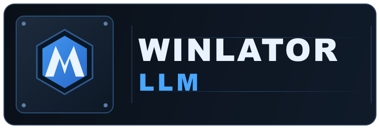

	  

# Winlator LLM

Winlator LLM is a Winlator fork developed with an LLM-assisted vibe-coding workflow.

The core goal is simple: make low-level runtime tuning accessible to regular users, not only power users.
That includes container internals, graphics-stack switches, compatibility knobs, and environment variables.

# Project Goals

1. Make advanced runtime controls easier to use without editing scripts manually.
2. Keep the build reproducible and debuggable for regression tracking.
3. Turn fragile low-level tweaks into manageable presets and defaults.

# Architecture

- Project architecture notes: [docs/ARCHITECTURE.md](docs/ARCHITECTURE.md)

# Installation

1. Download the APK from this repository's Releases page:
   [FrontMage/winlator-llm Releases](https://github.com/FrontMage/winlator-llm/releases)
2. Install the APK on your Android device.
3. Launch the app and wait for first-time setup to finish.

---

---

# Usage Tips

1. Use per-game shortcuts so each game can keep isolated runtime settings.
2. For .NET Framework apps, install Wine Mono from the start menu tools.
3. For some older games, try `MESA_EXTENSION_MAX_YEAR=2003` in container env vars.
4. Keep one stable container preset and one experimental preset for tuning.

# Credits and Third-Party Software

- Ubuntu RootFs ([Focal Fossa](https://releases.ubuntu.com/focal))
- Gst supplement (https://github.com/Waim908/rootfs-custom-winlator)
- Wine ([winehq.org](https://www.winehq.org/))
- Box86/Box64 by [ptitseb](https://github.com/ptitSeb)
- PRoot ([proot-me.github.io](https://proot-me.github.io))
- Mesa (Turnip/Zink/VirGL) ([mesa3d.org](https://www.mesa3d.org))
- DXVK ([github.com/doitsujin/dxvk](https://github.com/doitsujin/dxvk))
- VKD3D ([gitlab.winehq.org/wine/vkd3d](https://gitlab.winehq.org/wine/vkd3d))
- D8VK ([github.com/AlpyneDreams/d8vk](https://github.com/AlpyneDreams/d8vk))
- CNC DDraw ([github.com/FunkyFr3sh/cnc-ddraw](https://github.com/FunkyFr3sh/cnc-ddraw))

Special thanks to [ptitSeb](https://github.com/ptitSeb) (Box86/Box64), [Danylo](https://blogs.igalia.com/dpiliaiev/tags/mesa/) (Turnip), [alexvorxx](https://github.com/alexvorxx) (mods/tips), and all contributors.

Thanks to everyone supporting this project.

